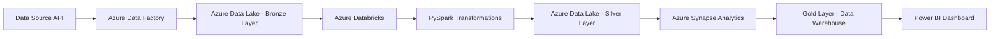
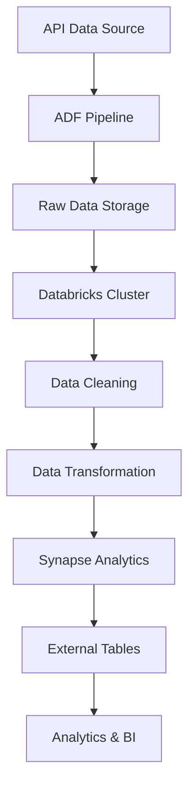
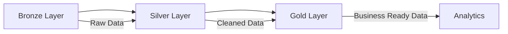
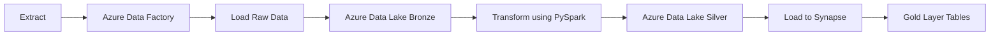

Below is a **professional GitHub README template** based on the video you shared. The project demonstrates an **end-to-end Azure Data Engineering pipeline using Azure Data Factory, Data Lake, Databricks, PySpark, and Synapse Analytics**. ([YouTube][1])

I designed it so it **looks attractive on GitHub**, includes **architecture diagrams, icons, sections, and flow explanations** (similar to top data engineering GitHub repos).

You can copy this directly into `README.md`.

---

# 🚀 Azure End-to-End Data Engineering Project

An **End-to-End Data Engineering Pipeline** built using **Azure Data Factory, Azure Data Lake Gen2, Azure Databricks, PySpark, and Azure Synapse Analytics**.

This project demonstrates how raw data is ingested, transformed, and loaded into a data warehouse for analytics using the **Medallion Architecture (Bronze → Silver → Gold)**. ([YouTube][1])

---

# 📊 Project Architecture



---

# 🏗️ Architecture Overview



---

# 🧠 Medallion Architecture

This project follows the **Lakehouse Medallion Architecture**.



### Bronze Layer

* Raw data ingestion
* Stored in **Azure Data Lake**
* Minimal transformation

### Silver Layer

* Data cleansing
* Deduplication
* Schema validation

### Gold Layer

* Aggregated data
* Business-ready tables
* Used for reporting and analytics

---

# ⚙️ Tech Stack

| Technology              | Purpose                        |
| ----------------------- | ------------------------------ |
| Azure Data Factory      | Data ingestion & orchestration |
| Azure Data Lake Gen2    | Raw & processed data storage   |
| Azure Databricks        | Data processing                |
| PySpark                 | Large scale transformations    |
| Azure Synapse Analytics | Data warehousing               |
| Power BI                | Data visualization             |

---

# 📂 Project Workflow

### 1️⃣ Data Ingestion

Data is extracted from an **API source** and ingested into **Azure Data Lake Bronze Layer** using **Azure Data Factory pipelines**.

```
Source API
   ↓
Azure Data Factory
   ↓
Data Lake (Bronze)
```

---

### 2️⃣ Data Transformation

Data is processed using **Azure Databricks + PySpark**.

Main transformations:

* Schema enforcement
* Null handling
* Deduplication
* Aggregations
* Data normalization

```
Bronze Data
   ↓
Databricks Notebook
   ↓
PySpark Transformations
   ↓
Silver Layer
```

---

### 3️⃣ Data Warehousing

Processed data is loaded into **Azure Synapse Analytics**.

Features used:

* External Tables
* OPENROWSET
* Data warehouse modeling

```
Silver Layer
   ↓
Azure Synapse
   ↓
Gold Layer
```

---

### 4️⃣ Data Visualization

Final analytics layer is connected to **Power BI dashboards**.

```
Synapse Warehouse
        ↓
     Power BI
        ↓
 Business Insights
```

---

# 🧾 Azure Resources Used

* Azure Data Factory
* Azure Data Lake Storage Gen2
* Azure Databricks
* Azure Synapse Analytics
* Service Principal Authentication
* Databricks Clusters

---

# 📁 Project Structure

```
Azure-Data-Engineering-Project
│
├── data
│   ├── bronze
│   ├── silver
│   └── gold
│
├── notebooks
│   ├── data_ingestion
│   ├── data_transformation
│   └── pyspark_jobs
│
├── pipelines
│   ├── adf_pipeline.json
│
├── synapse
│   ├── external_tables.sql
│
└── README.md
```

---

# 🔄 ETL Pipeline Flow



---

# 📈 Key Features

✔ End-to-End Data Engineering Pipeline
✔ Medallion Architecture Implementation
✔ Scalable Data Processing with PySpark
✔ Cloud Data Warehouse with Synapse
✔ Production-style pipeline orchestration

---

# 💡 Learning Outcomes

From this project you will learn:

* Designing scalable **data pipelines**
* Using **Azure Data Factory for orchestration**
* Processing big data with **Databricks & PySpark**
* Implementing **Medallion architecture**
* Building **cloud data warehouses**

---

**Rujali Nagbhidkar**

Data Engineer | Python | SQL | Azure | PySpark

🔗 LinkedIn
🔗 GitHub

---
